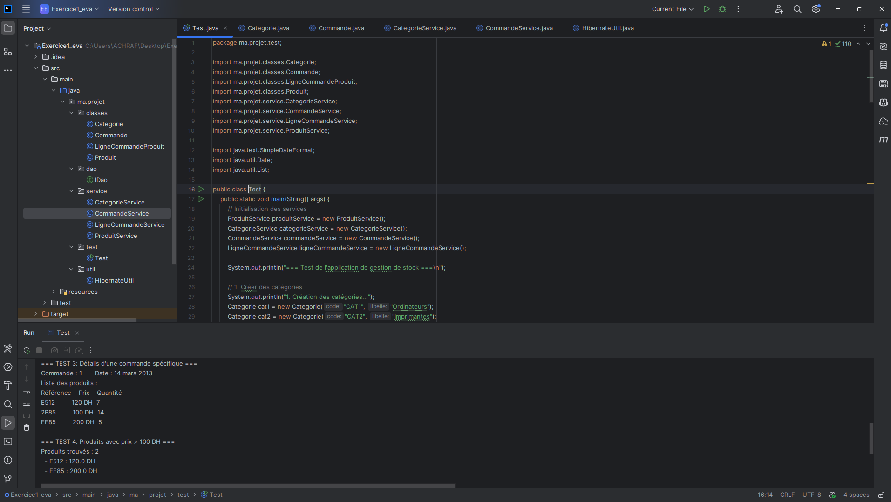

# Application de Gestion de Stock 

## Description
Application Java pour gérer le stock d'un magasin de produits informatiques.

## Structure du Projet

### 1. Couche Persistance (ma.projet.classes)
- **Categorie** : Entité représentant une catégorie de produits
- **Produit** : Entité représentant un produit
- **Commande** : Entité représentant une commande
- **LigneCommandeProduit** : Entité représentant la liaison entre commande et produit

### 2. Couche Service (ma.projet.service)
- **ProduitService** : Gestion CRUD des produits
- **CategorieService** : Gestion CRUD des catégories
- **CommandeService** : Gestion CRUD des commandes
- **LigneCommandeService** : Gestion des lignes de commande

### 3. Utilitaires (ma.projet.util)
- **HibernateUtil** : Gestion de la connexion à la base de données

### 4. DAO (ma.projet.dao)
- **IDao** : Interface générique pour les opérations CRUD

## Fonctionnalités Implémentées

✅ Afficher la liste des produits par catégorie
✅ Afficher la liste des produits commandés entre deux dates
✅ Afficher les produits commandés dans une commande donnée
✅ Afficher les produits dont le prix est supérieur à 100 DH
✅ Opérations CRUD complètes pour toutes les entités

## Technologies Utilisées
- Java 21
- JDBC (MySQL Connector)
- Maven
- MySQL 8.0

## Auteur
ACHRAF - Exercice d'évaluation

